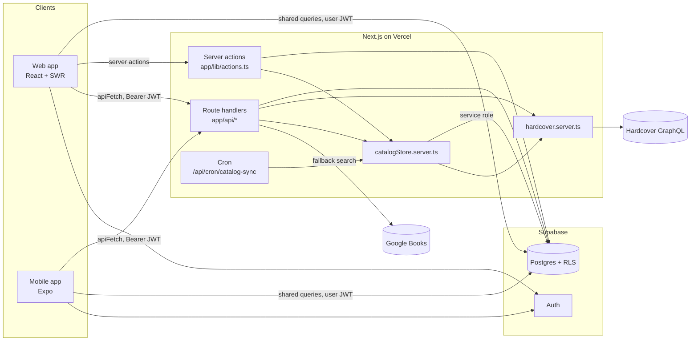
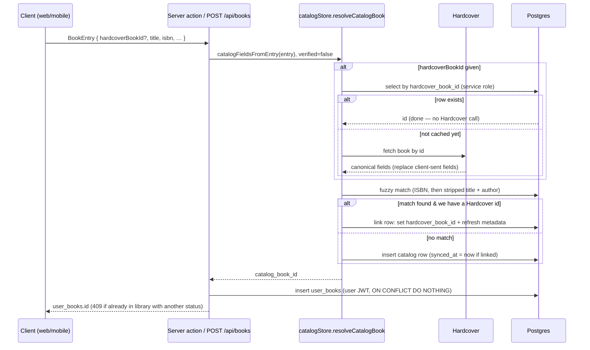

# Spine architecture

Spine is a reading journal with two clients (Next.js web, Expo iOS) on one
Supabase project. This document covers how the pieces fit together, how book
data flows between Hardcover and the database, and the rules that keep the
shared catalog consistent. The schema itself is documented in
[`database.md`](./database.md).

## Repository layout

```
apps/
  web/               Next.js 16 (App Router), deployed to Vercel
    app/api/         Route handlers (server-only work, mobile's API)
    app/lib/         Client data-access modules + *.server.ts server modules
    app/providers/   React context + SWR caches (books, quotes, log, …)
    proxy.ts         Next 16 middleware: session refresh + /api bearer gate
    vercel.json      Install command + cron schedule
  mobile/            Expo SDK 54 + Expo Router (iOS)
    lib/             Data access (calls web API routes or shared queries)
packages/
  shared/            Types, constants, date utils, and Supabase queries
                     shared by both clients (packages/shared/src/queries)
supabase/setup.sql   Historical bootstrap script — stale, see database.md
docs/                This documentation
```

## System overview



### Three ways clients reach data

| Path                                                                              | Used by                                                            | Auth                                                  | Examples                                                                  |
| --------------------------------------------------------------------------------- | ------------------------------------------------------------------ | ----------------------------------------------------- | ------------------------------------------------------------------------- |
| **Shared queries**: `packages/shared/src/queries/*` run directly against Supabase | web and mobile                                                     | user JWT, RLS enforces ownership                      | home dashboard, goals, habit log                                          |
| **Server actions**: `apps/web/app/lib/actions.ts`                                 | web only                                                           | cookie session (`createActionClient`)                 | create/update/delete book, thoughts, re-reads                             |
| **Route handlers**: `apps/web/app/api/*`                                          | web (`apiFetch`) and mobile (the mobile app has no server actions) | `Authorization: Bearer <user JWT>`; RLS still applies | books list/detail, lists, series, quotes, recommendations, catalog search |

`proxy.ts` rejects any `/api/*` request without a `Bearer` header, except
`GET /api/catalog` (public search). Route handlers then build a Supabase client
from that token (`createApiClient`), so every query runs as the user and RLS
is the real enforcement boundary. `getUserId` only decodes the JWT to add
`user_id` filters; it doesn't verify the token. RLS does.

### Server-only modules

Files ending in `.server.ts` never ship to the browser:

| Module                   | Responsibility                                                                                                    |
| ------------------------ | ----------------------------------------------------------------------------------------------------------------- |
| `supabase-server.ts`     | `createApiClient` (bearer JWT), `createActionClient` (cookies), `createAdminClient` (service role — bypasses RLS) |
| `hardcover.server.ts`    | **The only Hardcover client.** Search, fetch by id, ISBN lookup, editions, parsing, title-matching utilities      |
| `catalogStore.server.ts` | **The only writer of `catalog_books`.** Resolves or creates catalog rows                                          |
| `bookUpsert.server.ts`   | Creates `user_books` rows, maps client patches onto user columns, flattens rows for API responses                 |
| `catalogSync.server.ts`  | Links unlinked catalog rows to Hardcover and refreshes stale ones                                                 |

## Book data model: catalog vs. personal

Book data lives in two layers:

- **`catalog_books`**: one row per real-world book, shared by all users. It
  is a **cache of Hardcover**, keyed by `hardcover_book_id`. Users never write
  to it directly.
- **`user_books`**: one row per (user, book). It holds reading state (status,
  dates, rating, feeling, mood tags, shelves) plus **per-user overrides** that
  shadow catalog values:

  | Override column                      | Shadows                    | Set when the user…                      |
  | ------------------------------------ | -------------------------- | --------------------------------------- |
  | `title_override`                     | `catalog_books.title`      | edits the title                         |
  | `author_override`                    | `catalog_books.author`     | edits the author                        |
  | `cover_url_override`                 | `catalog_books.cover_url`  | picks another edition's cover           |
  | `page_count_override`                | `catalog_books.page_count` | corrects the page count (their edition) |
  | `user_genres` (merged, not replaced) | `catalog_books.genres`     | adds genres                             |
  | `diversity_tags`                     | (user-only)                | adds diversity tags                     |

Every read coalesces `override ?? catalog`. `flattenUserBook` does this for
`/api/books*`, and the embedded selects in `shared/queries/home.ts`,
`shared/queries/lists.ts` and `lib/series.ts` do it for their views. **Any new
query that shows a cover, title, author or page count must select the
override column too.**

Why this split: one user picking a different cover, or fixing a page count for
their edition, must not change the book for anyone else. Before Oct 2026 these
edits wrote to the shared row.

## Hardcover vs. database: what lives where

| Data                                    | Source of truth                   | Stored?                            | Freshness                       |
| --------------------------------------- | --------------------------------- | ---------------------------------- | ------------------------------- |
| Search results                          | Hardcover (Google Books fallback) | No. Next data cache only (60 s)    | Live                            |
| Edition list (cover picker)             | Hardcover                         | No. Next data cache (60 s)         | Live                            |
| Metadata of books in someone's library  | Hardcover                         | Yes, `catalog_books`               | Refreshed by cron every 30 days |
| Reading state, notes, quotes, overrides | Spine                             | Yes, `user_books` and child tables | —                               |

Rules:

1. **Never call Hardcover while rendering a page.** Library, lists, stats and
   the book page read only from Postgres.
2. **Call Hardcover for discovery** (search, editions) and **when a book first
   enters the catalog** (add, import).
3. **All Hardcover calls go through `hardcover.server.ts`** (`hcPost`): one
   place for the token, retries on 408/5xx, and caching.
4. **One top-level field per GraphQL request.** Hardcover counts every
   top-level field as a request, and answers **403** when a query has more
   than its burst limit allows, so aliased batches (`b0: books(…) b1: books(…)`)
   fail. To batch, use a single field with `_in` (`fetchBooksByIds`,
   `fetchBooksByIsbns`), and pass values as GraphQL variables, never string
   interpolation.
5. The rate limit is about 60 requests/min. Batch jobs sleep 2 s between
   batches and 1 s after each title search.
6. Some author fields (`gender`, `nationality`) are restricted, and requesting
   them makes Hardcover answer 403 for the whole query.

## Adding a book (the catalog write path)



Key properties:

- **Identity is `hardcover_book_id`.** Search results carry it
  (`/api/catalog` → `hardcover_book_id`), and it travels on `CatalogEntry` and
  `BookEntry` to the server.
- **Client-sent catalog fields are untrusted.** With `verified: false`, a
  claimed Hardcover id is re-fetched and Hardcover's data wins. If Hardcover
  can't confirm the id, it's dropped and the book is stored unlinked; catalog
  sync links it later. Unlinked input never modifies an existing row.
- **Fuzzy matching is a fallback** for Google Books results, manual entries
  and legacy rows. When the input has a Hardcover id, only unlinked rows are
  match candidates, because a row with a different Hardcover id is a different
  book.
- The Goodreads import builds its catalog fields server-side from Hardcover
  and passes `verified: true`.

## Catalog sync

`catalogSync.server.ts#syncCatalogRows` handles two cases:

- **Linked rows**: re-fetched by `hardcover_book_id` in one batched query per
  10 rows.
- **Unlinked rows**: resolved by ISBN (title must match) or by title + author
  search, then linked.

The refresh patch (`hardcoverRefreshPatch`) overwrites page count, release
date, publisher and audio duration, and merges ISBNs. It leaves title and
author alone, and **only fills `cover_url` and `genres` when they're empty**:
Hardcover's default edition often isn't the cover people recognise, and its
tags are noisy. Genres come from Hardcover's `Genre` tag category when it
exists.

Every row that gets a Hardcover answer is stamped `synced_at = now()`, so rows
Hardcover can't resolve aren't retried for 30 days. If a Hardcover **request
fails** (403, outage), the run stops without stamping anything, so the rows
are retried next time. A row whose Hardcover id already belongs to another
catalog row is reported as a duplicate and left unlinked.

Triggers:

| Trigger                                                           | Scope                                                                                                                               |
| ----------------------------------------------------------------- | ----------------------------------------------------------------------------------------------------------------------------------- |
| `POST /api/admin/backfill` ("Enrich library" on the profile page) | The caller's catalog rows with `synced_at IS NULL`. Runs in `after()` and is resumable: a timed-out run continues on the next click |
| `GET /api/cron/catalog-sync` (Vercel cron, daily 09:00 UTC)       | The 100 stalest rows overall: never synced first, then `synced_at` older than 30 days. Requires `CRON_SECRET`                       |

## Other server-side flows

- **Goodreads import** (`/api/admin/import-goodreads`): parses the CSV, looks
  up each batch of 10 with one ISBN request plus a search per ISBN-less row,
  checks that titles
  match, then calls `upsertBookForUser`. For books already in the library it
  upgrades status by priority (finished > reading > dnf > want-to-read) and
  records distinct re-reads in `book_reads`. Progress is kept in
  `auth.users.user_metadata.goodreads_import`.
- **Auto-log**: reading-activity edits (status, dates, rating, feeling) call
  `autoLogToday`, which marks the day in `reading_log`.

## Environment variables (web)

| Variable                                                                   | Used for                                                                                         |
| -------------------------------------------------------------------------- | ------------------------------------------------------------------------------------------------ |
| `NEXT_PUBLIC_SUPABASE_URL`, `NEXT_PUBLIC_SUPABASE_PUBLISHABLE_DEFAULT_KEY` | All Supabase clients                                                                             |
| `SUPABASE_SERVICE_ROLE_KEY`                                                | `createAdminClient`: catalog writes, import, sync. **Required**: without it, adding a book fails |
| `HARDCOVER_API_TOKEN`                                                      | Hardcover. Without it, search falls back to Google Books and new books are stored unlinked       |
| `GOOGLE_BOOKS_API_KEY`                                                     | Optional, for the Google Books fallback                                                          |
| `CRON_SECRET`                                                              | Authenticates Vercel's cron call to `/api/cron/catalog-sync`; the route returns 401 if unset     |

## Conventions

- Data access stays in `app/lib/` (client) or `*.server.ts` (server), not in
  components, so it can later move to a separate backend.
- Server code that must bypass RLS uses `createAdminClient` and **must scope by
  `user_id` itself**. Only catalog writes, background jobs and `auth.admin`
  calls should need it.
- Schema changes are applied as named migrations through Supabase (see
  [`database.md`](./database.md#migrations)). New tables need explicit
  `GRANT`s for `authenticated` **and** `service_role`; RLS policies alone
  aren't enough.
