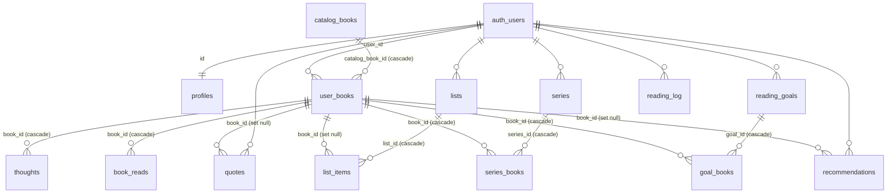

# Spine database

Postgres on Supabase (one project shared by web, mobile and local dev). This
document was generated from the **live** schema on 2026-10-06.
`supabase/setup.sql` is out of date; don't use it as a reference. To check
the current shape, use the Supabase dashboard or `list_tables` through the
Supabase MCP.

How the app uses these tables is covered in [`architecture.md`](./architecture.md).

## Entity relationships



All book-related child tables (thoughts, quotes, reads, list items, series,
goals) reference **`user_books.id`**, the user's copy of a book, never
`catalog_books.id`. Only `user_books` points at the shared catalog.

## Tables

### `catalog_books`: shared Hardcover cache

One row per real-world book, shared across users. Written **only** by the
server with the service-role key (`catalogStore.server.ts`,
`catalogSync.server.ts`).

| Column                     | Type                      | Notes                                                                                                                                    |
| -------------------------- | ------------------------- | ---------------------------------------------------------------------------------------------------------------------------------------- |
| `id`                       | uuid PK                   | `gen_random_uuid()`                                                                                                                      |
| `hardcover_book_id`        | int, **unique**, nullable | Hardcover `books.id`, the catalog's identity key. Null = not yet linked (Google Books result, manual entry, or legacy row awaiting sync) |
| `title`                    | text                      | Canonical title (series suffix stripped on import)                                                                                       |
| `author`                   | text                      | Comma-joined contributor names                                                                                                           |
| `cover_url`                | text, default `''`        | Default edition's cover. Sync only fills it when empty                                                                                   |
| `isbns`                    | text[], default `{}`      | Every known ISBN-10/13 across editions. GIN-indexed for `@>` lookups                                                                     |
| `release_date`             | text                      | `YYYY-MM-DD`, or year-only `YYYY-01-01` from search fallbacks                                                                            |
| `genres`                   | text[]                    | Up to 5 Hardcover cached tags                                                                                                            |
| `page_count`               | int, nullable             |                                                                                                                                          |
| `publisher`                | text                      | Default edition's publisher                                                                                                              |
| `audio_duration_minutes`   | int, nullable             | From the default audio edition                                                                                                           |
| `synced_at`                | timestamptz, nullable     | Last Hardcover sync attempt. Null = never synced. Rows older than 30 days get refreshed by cron                                          |
| `created_at`, `updated_at` | timestamptz               |                                                                                                                                          |

Indexes: `catalog_books_pkey`, `catalog_books_hardcover_book_id_key`
(unique), `idx_catalog_books_isbns` (GIN on `isbns`).

### `user_books`: a user's copy of a book

| Column                                                        | Type                             | Notes                                                         |
| ------------------------------------------------------------- | -------------------------------- | ------------------------------------------------------------- |
| `id`                                                          | uuid PK                          | Referenced by every book-related child table                  |
| `user_id`                                                     | uuid → `auth.users` (cascade)    |                                                               |
| `catalog_book_id`                                             | uuid → `catalog_books` (cascade) | Unique per user: `(user_id, catalog_book_id)`                 |
| `status`                                                      | text, default `'want-to-read'`   | `reading` · `finished` · `want-to-read` · `did-not-finish`    |
| `date_started`, `date_finished`, `date_shelved`, `date_dnfed` | date                             | Dates for the current read; earlier reads are in `book_reads` |
| `rating`                                                      | numeric, default 0               | Half-star ratings                                             |
| `feeling`                                                     | text                             | Free-text reflection                                          |
| `mood_tags`                                                   | text[]                           | Normalized by trigger `user_books_normalize_mood_tags_trg`    |
| `bookshelves`                                                 | text[]                           | Goodreads shelves from import                                 |
| `user_genres`                                                 | text[]                           | Merged with `catalog_books.genres` on read                    |
| `diversity_tags`                                              | text[]                           | User-entered                                                  |
| `format`                                                      | text                             | hardcover / paperback / ebook / audiobook / …                 |
| `bookmarked`, `up_next`                                       | bool                             |                                                               |
| `title_override`, `author_override`                           | text, nullable                   | **Per-user overrides**: shadow catalog values on read         |
| `cover_url_override`                                          | text, nullable                   | Set by the cover picker                                       |
| `page_count_override`                                         | int, nullable                    |                                                               |
| `created_at`, `updated_at`                                    | timestamptz                      |                                                               |

Indexes: `(user_id, catalog_book_id)` unique; `(user_id, status)`;
`(user_id, date_finished|date_started|date_shelved|updated_at DESC NULLS
LAST)`; `(catalog_book_id)`.

Reading rule: **`effective_x = x_override ?? catalog_books.x`**. See
`flattenUserBook` in `apps/web/app/lib/bookUpsert.server.ts`.

### Reading activity

| Table         | Purpose                                    | Key columns                                                                                                            |
| ------------- | ------------------------------------------ | ---------------------------------------------------------------------------------------------------------------------- |
| `book_reads`  | Previous reads of a book (re-read history) | `book_id` → user_books (cascade), `user_id`, `status` (default `finished`), the four date columns, `rating`, `feeling` |
| `thoughts`    | Timestamped notes on a book                | `book_id` → user_books (cascade), `text`, `page_number`, `created_at`                                                  |
| `quotes`      | Saved quotes                               | `user_id`, `book_id` → user_books (set null), `text`, `page_number` (text)                                             |
| `reading_log` | One row per user per day read              | `user_id`, `log_date` (unique per user), `logged`, `note`, `pages_read`. Upserted by `autoLogToday`                    |

### Goals

| Table           | Purpose                                 | Key columns                                                                                                   |
| --------------- | --------------------------------------- | ------------------------------------------------------------------------------------------------------------- |
| `reading_goals` | Yearly goal (`is_auto`) or custom goals | `user_id`, `year`, `target`, `name`, `is_auto`                                                                |
| `goal_books`    | Books pinned to a custom goal           | `goal_id` → reading_goals (cascade), `book_id` → user_books (cascade), `user_id`. Unique `(goal_id, book_id)` |

### Lists, series, recommendations

| Table             | Purpose                          | Key columns                                                                                                                                                              |
| ----------------- | -------------------------------- | ------------------------------------------------------------------------------------------------------------------------------------------------------------------------ |
| `lists`           | Custom lists per year            | `user_id`, `year`, `title`, `list_type` (default `general`), `sort_order`, display fields (`color`, `emoji`, `bullet_symbol`, `date_label`, `notes_label`), `bookmarked` |
| `list_items`      | Entries in a list                | `list_id` → lists (cascade), optional `book_id` → user_books (set null), free-text `title`/`author`, `notes`, `item_date`, `price`, `type`, `direction`, `sort_order`    |
| `series`          | A series being tracked           | `user_id`, `name`, `author`                                                                                                                                              |
| `series_books`    | Books in a series                | `series_id` → series (cascade), `book_id` → user_books (cascade), `position`, `status` (`unread`/`reading`/`read`/`skipped`). Unique `(series_id, book_id)`              |
| `recommendations` | Books recommended to/by the user | `user_id`, `title`, `author`, `recommended_by`, `notes`, `direction` (`incoming`/…), optional `book_id` → user_books (set null)                                          |

### Users

| Table                      | Purpose                      | Key columns                                                                                                                                                  |
| -------------------------- | ---------------------------- | ------------------------------------------------------------------------------------------------------------------------------------------------------------ |
| `profiles`                 | Public profile per auth user | `id` → auth.users (cascade), `username` (unique, `^[a-z0-9_]{3,30}$`), `name`, `avatar_url`. Created by trigger `on_auth_user_created` → `handle_new_user()` |
| `auth.users.user_metadata` | Job state                    | `goodreads_import` (progress), `goodreads_imported`, `backfill_running`                                                                                      |

## Row-level security

RLS is enabled on every table. Policies as of 2026-10-06:

| Table                                                                                                      | Policy                                                                                                                              |
| ---------------------------------------------------------------------------------------------------------- | ----------------------------------------------------------------------------------------------------------------------------------- |
| `user_books`, `lists`, `reading_log`, `quotes`, `reading_goals`, `series`, `recommendations`, `goal_books` | Owner only: `auth.uid() = user_id` (quotes: select/insert/delete, no update; reading_goals and reading_log: per-command policies)   |
| `thoughts`, `book_reads`                                                                                   | Through the parent: `book_id IN (user's user_books)`                                                                                |
| `list_items`                                                                                               | Through the parent: `list_id IN (user's lists)`                                                                                     |
| `series_books`                                                                                             | Through the parent: `EXISTS series with user_id = auth.uid()`                                                                       |
| `profiles`                                                                                                 | Any authenticated user can read; owner inserts/updates                                                                              |
| `catalog_books`                                                                                            | Authenticated users can **read only**. INSERT/UPDATE/DELETE are revoked from `authenticated` and `anon`; only `service_role` writes |

`service_role` bypasses RLS. Server code using it (`createAdminClient`) must
filter by `user_id` itself.

## Functions and triggers

| Name                                                               | Kind                         | Notes                                                                                  |
| ------------------------------------------------------------------ | ---------------------------- | -------------------------------------------------------------------------------------- |
| `handle_new_user()`                                                | trigger fn, SECURITY DEFINER | `AFTER INSERT ON auth.users`: creates the `profiles` row                               |
| `is_username_available(p_username)`                                | SECURITY DEFINER             | Username check during signup                                                           |
| `user_books_normalize_mood_tags()` / `normalize_mood_tags(text[])` | trigger fn                   | `BEFORE INSERT/UPDATE ON user_books`                                                   |
| `start_new_read(...)`                                              | SECURITY DEFINER             | Moves the current read into `book_reads` and resets `user_books` (two overloads exist) |
| `add_thought(...)`, `remove_thought(...)`                          |                              | Thought RPCs (`add_thought` has two overloads, one SECURITY DEFINER)                   |
| `reorder_lists(ids, orders)`, `reorder_list_items(ids, orders)`    |                              | Batch `sort_order` updates                                                             |
| `rls_auto_enable()`                                                | SECURITY DEFINER             | Supabase helper                                                                        |

## Migrations

There are no migration files in the repo. Migrations are applied as named
migrations to the Supabase project (dashboard SQL editor or the Supabase MCP's
`apply_migration`), and the history lives in
`supabase_migrations.schema_migrations`. To see it, use `list_migrations`.

Checklist for a new table:

1. `alter table … enable row level security` plus owner policies.
2. `grant select, insert, update, delete on … to authenticated, service_role;`
   RLS doesn't grant table privileges, and missing grants cause silent
   failures.
3. FK to `user_books(id)` (not `catalog_books`) for anything about a user's
   book.
4. Update this document.

### Recent: `catalog_as_hardcover_cache` (2026-10-06)

- Added `catalog_books.hardcover_book_id` (unique) and `catalog_books.synced_at`.
- Added `user_books.cover_url_override` and `user_books.page_count_override`.
- Dropped the duplicate unique constraint `user_books_user_catalog_unique`
  (identical to `user_books_user_id_catalog_book_id_key`).
- Deleted 10 `catalog_books` rows that no `user_books` row referenced
  (leftovers from the removed `/api/catalog/upsert` route).

### Recent: `lock_down_catalog_books_writes` (2026-10-06)

Applied once the service-role write path was deployed and the library had
been enriched (967 of 980 rows linked to Hardcover):

```sql
drop policy if exists "authenticated insert catalog_books" on public.catalog_books;
drop policy if exists "authenticated update catalog_books" on public.catalog_books;
revoke insert, update, delete on public.catalog_books from authenticated, anon;
```

## Known issues

- `series.user_id`, `recommendations.user_id` and `goal_books.user_id`
  reference `auth.users` **without** `ON DELETE CASCADE`, so deleting a user
  who has rows there fails.
- `add_thought` and `start_new_read` each have two overloads. The older
  4-argument `add_thought` still runs `UPDATE books …` on the long-dropped
  `books` table, so calling it errors. The stale overloads (`add_thought`
  without `p_page_number`, `start_new_read` without `p_date_dnfed`) should be
  dropped once the callers are confirmed.
- "King of Gluttony" (Ana Huang) has two `user_books`/`catalog_books` rows for
  one user. The second is reported by catalog sync as a duplicate of the row
  linked to Hardcover id 801802 and stays unlinked. Merging them means moving
  thoughts/quotes/reads onto one `user_books` row.
- 13 catalog rows aren't linked to Hardcover after the initial sync (titles
  Hardcover lacks, title mismatches such as "Sorcerer's" vs "Philosopher's
  Stone", and the duplicate above). The cron retries them every 30 days.
- When Hardcover has no `Genre` tag category for a book, genres fall back to
  all tag categories, so a few rows (e.g. "The Housemaid") hold reader tags
  instead of genres.
- `supabase/setup.sql` doesn't match the live schema.
